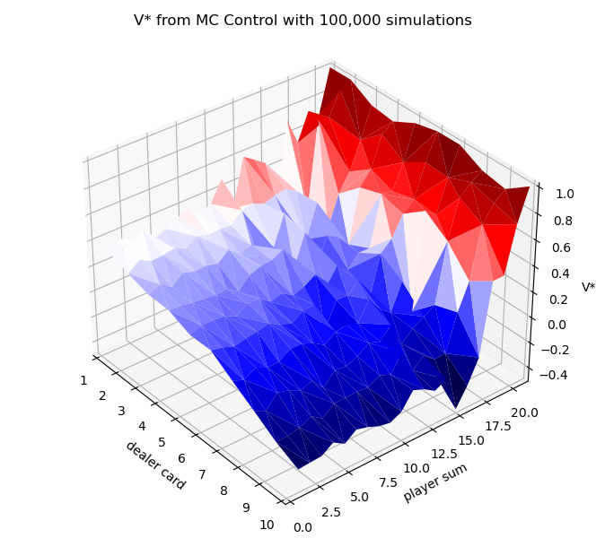
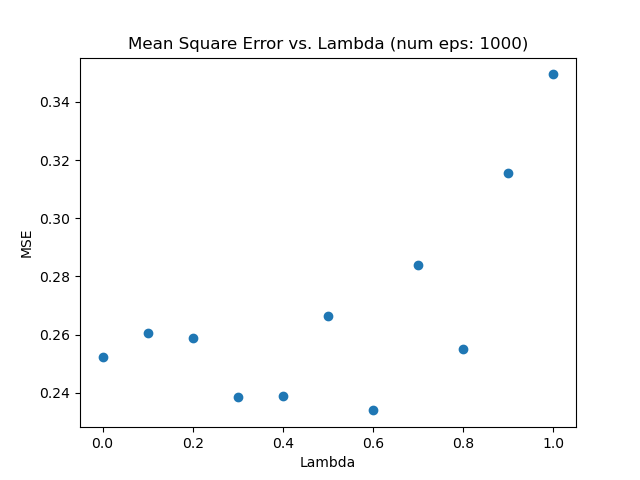
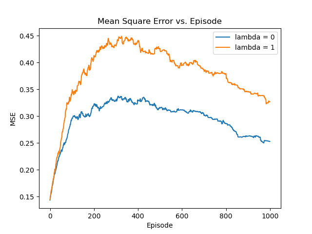
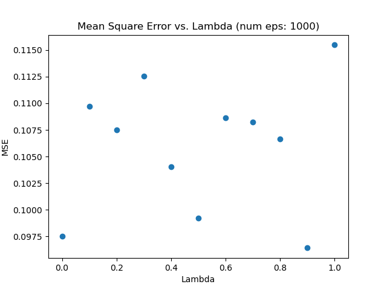
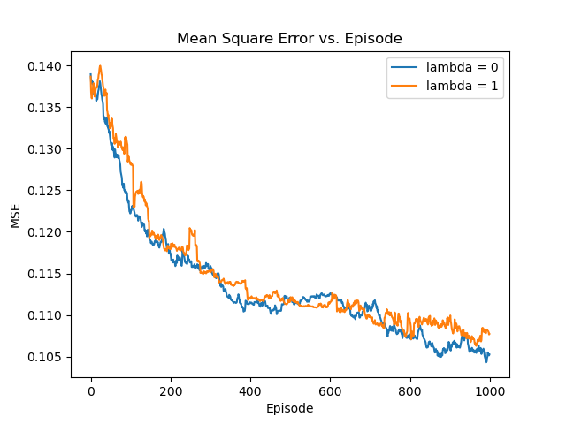

# Easy21
My solutions to [David Silver's Easy21 assignment](https://www.davidsilver.uk/teaching/).

Code and discussion answers are not guaranteed to be correct.

## Monte Carlo Control

##TD Learning
TD backup with time-varying alpha and epsilon (see assignment)

## Linear Function Approximation
TD backup with constant:
epsilon = 0.05,
alpha = 0.01

## Discussion

Q: What are the pros and cons of bootstrapping in Easy21?

A: TODO

Q: Would you expect bootstrapping to help more in blackjack or Easy21? Why?

A: TODO